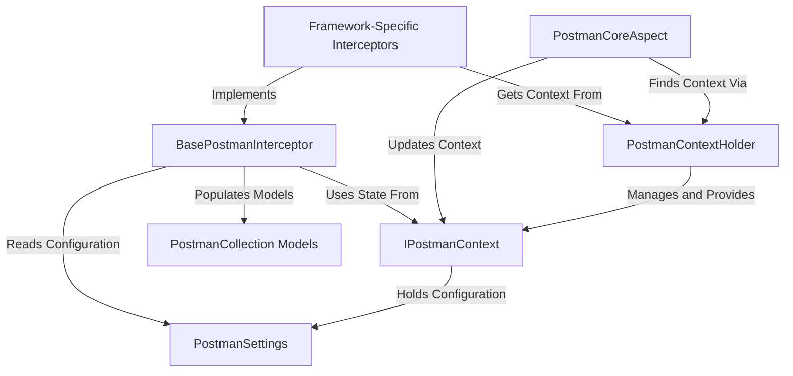

# Classes hierarchy

```mermaid
flowchart TD
    A0["BasePostmanInterceptor
"]
    A1["IPostmanContext
"]
    A2["PostmanContextHolder
"]
    A3["PostmanCollection Models
"]
    A4["PostmanSettings
"]
    A5["PostmanCoreAspect
"]
    A6["Framework-Specific Interceptors
"]
    A6 -- "Implements" --> A0
    A6 -- "Gets Context From" --> A2
    A0 -- "Uses State From" --> A1
    A0 -- "Populates Models" --> A3
    A0 -- "Reads Configuration" --> A4
    A5 -- "Updates Context" --> A1
    A5 -- "Finds Context Via" --> A2
    A2 -- "Manages and Provides" --> A1
    A1 -- "Holds Configuration" --> A4
```