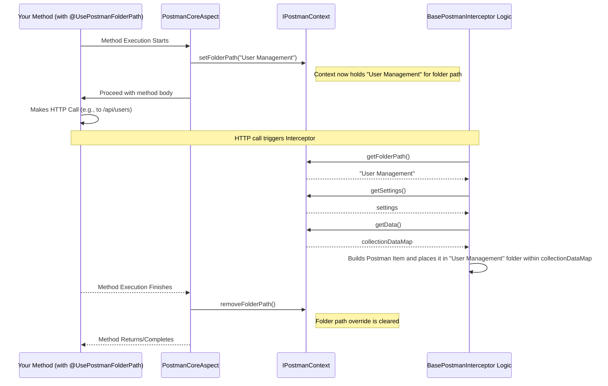

# What is context in Postman4j?

Context is a name of postman collection and settings of writing to this collection by postman4j interceptors.
This allow multiple different postman4j interceptors to write to the same context.
For example, you can have multiple apache `HttpClient` in your applicated that intercepted by `Postman4j` - all of them will write to the same context, so all requests will be in the same postman collection.
**By default context name is `Generated Context` and all interceptors write to this context.**

Context name could be defined over `@UsePostmanCollection` annotation or over property `contexts` in folder and request level annotations.

